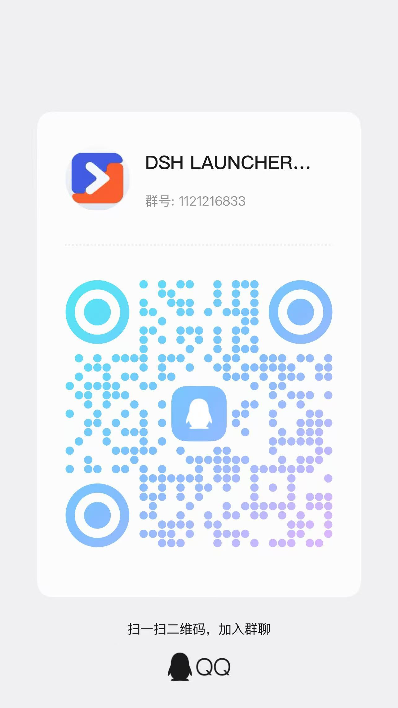
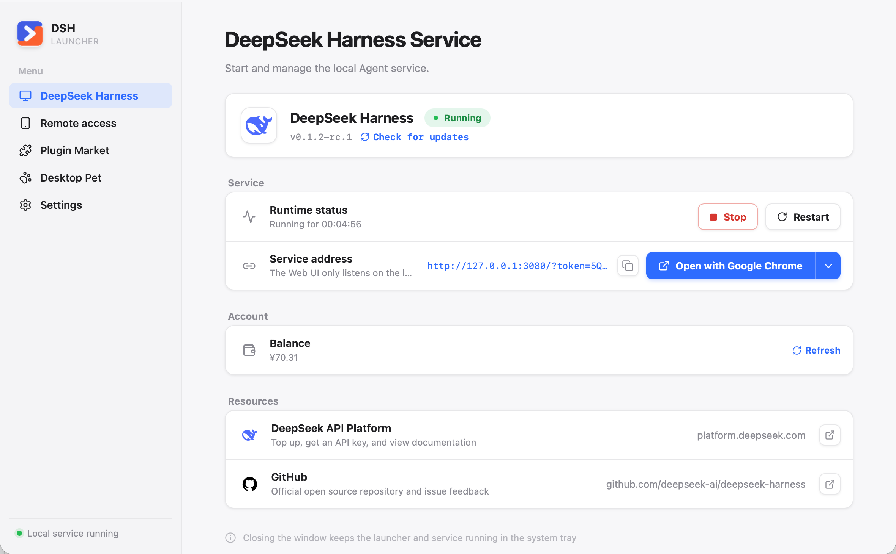
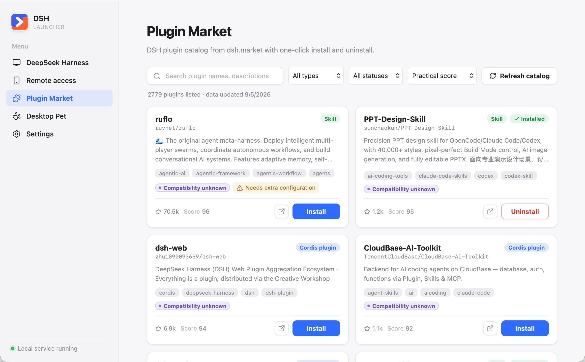
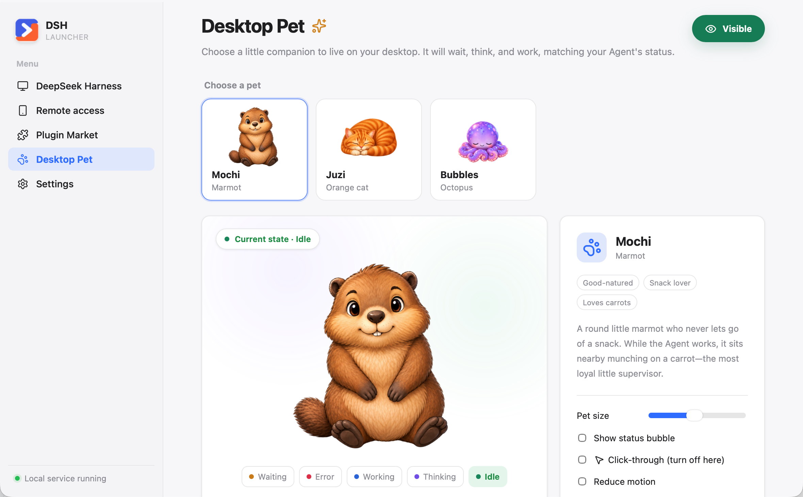
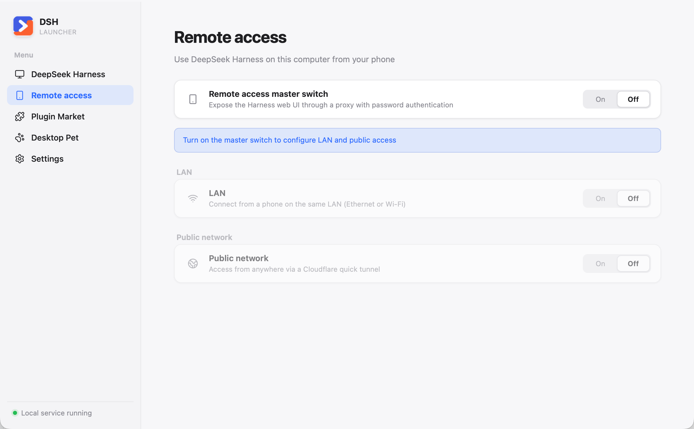
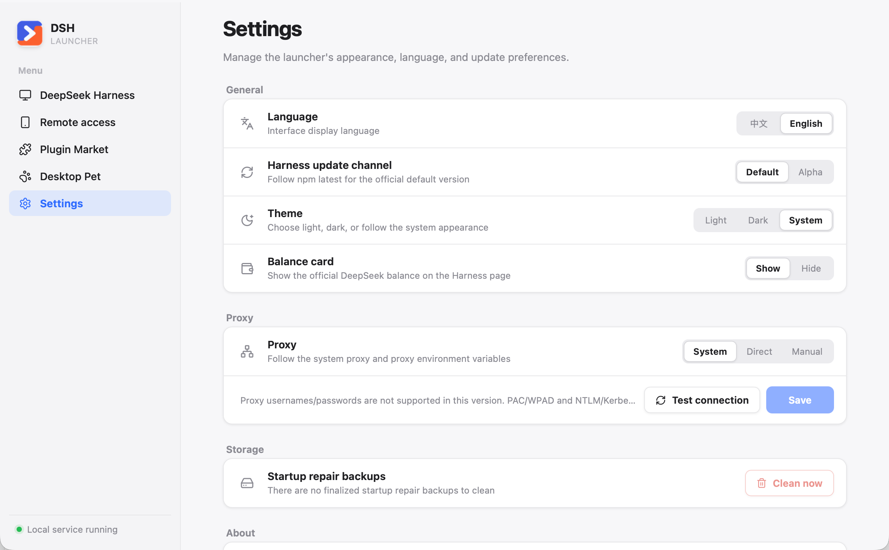

# DSH Launcher

English | [中文](https://github.com/Gru110110110/deepseek-harness-desktop-launcher/blob/main/README.zh.md)

Want to use DeepSeek Harness without first wrestling with Node, npm, and launch commands? DSH Launcher is an unofficial desktop launcher built around the published `@deepseek-ai/dsh` package, with that setup handled inside the app. Install it once, then double-click to prepare a verified, isolated runtime, start the official `dsh web`, and open the original Harness Web UI in your chosen browser.

Launch management, updates, the plugin marketplace, remote access, and Desktop Pet all live in one window. The managed runtime stays separate from your existing Harness data, and a failed deployment preserves the working environment.

Download the macOS or Windows build from the [DSH Launcher website](https://dsdesktop.com). Questions, bug reports, and ideas are welcome in the QQ group `1121216833`.



Technical architecture, data-safety guarantees, and release details live in [docs/IMPLEMENTATION.md](docs/IMPLEMENTATION.md).

## Core features

### Launch and manage DeepSeek Harness

The home page prepares and verifies the private Node.js/Harness runtime, starts or stops the official service, shows its real address and uptime, and opens the official Web UI in the browser you choose. Harness and desktop updates are surfaced separately so you always know what is changing. If an update leaves an incompatible derived session index or third-party plugin, **Repair and start** rebuilds the index from retained session logs and removes only identified incompatible plugins through recoverable transactions. Finalized repair backups are automatically bounded by age, count, and total size and can be reviewed or cleaned in Settings.



### Install plugins from the marketplace

Search, filter, inspect, one-click install, and one-click uninstall Cordis and Skill plugins from a validated marketplace snapshot. With a verified source and compatible package, one click installs the whole package group into the Harness Web environment, restarts an idle Harness, and checks that its page responds; confirmation appears only for a real source or compatibility warning. Registry packages are pinned to exact versions, while valid GitHub-only Cordis bundles are pinned to immutable commits; ordinary repositories without a `dsh.bundle` manifest are blocked instead of being guessed as npm packages. Skills that declare extra Python or npm dependencies show the reviewed command separately after bundle installation: you can copy it, or explicitly approve a supported shell-free command for the launcher to run; scripts, pipes, redirects, and chained commands remain copy-only. Uninstall removes the recorded package group and its marketplace-recorded copies in older profiles, while preserving shared packages and existing configuration. Failed activation restores the previous environment. Older standalone copies offer a “Fix” action to install into Harness. When Harness has ongoing work or its activity cannot be verified, installation and removal finish without restarting it; changes remain pending until you manually restart. Existing pending changes also prevent later installs from triggering a restart. Otherwise, Harness opens the updated page once using its existing startup behavior. If a Harness update makes an installed plugin fail during startup, the launcher retries through a reversible uninstall and tells you exactly which plugin was removed.



### Keep a desktop pet beside your work

Choose Mochi the marmot, Juzi the orange cat, or Bubbles the octopus.

The first-class Desktop Pet page lets you choose a companion, preview its five states, and control its size, speech bubble, motion, and mouse click-through behavior. The separate transparent always-on-top pet window follows top-level Harness work in real time: idle, reasoning-only thinking, active work, waiting for you, or error. Rapid updates are coalesced and applied only between complete animation cycles, so state changes stay smooth without building a stale playback backlog. Its position and preferences persist across launches, and the tray menu can show or hide it without reopening the main window.



### Use Harness from your phone

Remote access exposes the loopback-only Harness Web UI through the launcher's authenticated proxy. It supports both older bare `dsh web` URLs and newer launch-token URLs without putting Harness's private token into a remote link. Use a QR code and a rotatable 8-digit password on the same LAN (the computer may use Ethernet or Wi-Fi), or explicitly enable a temporary Cloudflare quick tunnel for public access; rotating the password immediately revokes existing sessions.



### Configure the launcher in one place

Settings keeps language, light/dark/system theme, the optional balance card, proxy mode and connectivity testing, desktop update checks, and project links together.



## Product scope

- macOS arm64 and x64 DMG installers
- Windows x64 per-user NSIS installer; no portable ZIP
- Pinned Node.js 24.19.0, admitted only by platform-specific SHA-256
- Exact `@deepseek-ai/dsh` installation through the configured npm registries
- A stable terminal `dsh` command backed by the launcher's private runtime
- Browser selection, system tray lifecycle, English/Simplified Chinese, and light/dark/system themes
- Plugin marketplace backed by the validated [dsh-market](https://github.com/2BingLing/dsh-market) snapshot
- Separate Harness updates and cryptographically signed desktop updates, with Default and Alpha Harness update channels and an explicit rollback action when the retained previous runtime is available
- Remote access with QR codes, rotatable passwords, and an optional Cloudflare quick tunnel
- A bilingual, catalog-driven desktop pet with five live Harness states and a transparent draggable window

## Architecture

```text
React feature registry + HashRouter
  └─ typed launcher API / revisioned state event
      └─ Tauri command and lifecycle adapter
          └─ dsh-core application services
              ├─ runtime deployment and rollback
              ├─ source/CC Switch import
              ├─ managed dsh web process tree
              ├─ plugin marketplace
              ├─ remote access proxies and cloudflared tunnel
              ├─ desktop pet state bridge and event service
              └─ browser and preferences ports
                  └─ pinned Node.js → published @deepseek-ai/dsh
```

Business rules live in `dsh-core`, which has no Tauri dependency; Tauri owns only OS lifecycle, tray, clipboard, updater integration, and typed IPC. Process management, recovery, and data-safety behavior are detailed in [docs/IMPLEMENTATION.md](docs/IMPLEMENTATION.md).

## Development

Prerequisites: Node.js 24+, pnpm 10.12.3, and Rust 1.96.

```sh
validation_root=$(mktemp -d /tmp/dsh-launcher-dev.XXXXXX)
export DSH_DESKTOP_HOME="$validation_root/desktop"
export DSH_HOME="$validation_root/dsh"
export DSH_DESKTOP_SOURCE_HOME="$validation_root/source"
export DSH_DESKTOP_CC_SWITCH_HOME="$validation_root/cc-switch"

pnpm install --frozen-lockfile
pnpm bindings
pnpm lint
pnpm test
pnpm deadcode
pnpm build
cargo test --workspace --all-targets
cargo clippy --workspace --all-targets -- -D warnings
pnpm tauri dev
```

`pnpm bindings` generates [bindings.ts](src/platform/generated/bindings.ts) from the Rust domain types; commit the result and verify that regenerating it produces no diff. The product website and the release/signing workflow are documented in [docs/IMPLEMENTATION.md](docs/IMPLEMENTATION.md).

## Runtime environment overrides

| Variable                     | Meaning                                                                                                                                                                                   |
| ---------------------------- | ----------------------------------------------------------------------------------------------------------------------------------------------------------------------------------------- |
| `DSH_DESKTOP_HOME`           | Launcher/runtime home; defaults to `~/.dsh-desktop`                                                                                                                                       |
| `DSH_HOME`                   | Explicit external Harness home; bypasses the isolated desktop `dsh-home` and disables all imports. Set it only deliberately.                                                              |
| `DSH_DESKTOP_SOURCE_HOME`    | Optional source-home import; defaults to `~/.dsh`                                                                                                                                         |
| `DSH_DESKTOP_CC_SWITCH_HOME` | Optional read-only CC Switch source; defaults to CC Switch's active Windows data directory (including its Store override and legacy `HOME` fallback) or `~/.cc-switch` on other platforms |
| `DSH_DESKTOP_NODE_VERSION`   | Exact Node override; requires `DSH_DESKTOP_NODE_SHA256`                                                                                                                                   |
| `DSH_DESKTOP_NODE_SHA256`    | SHA-256 trust root for an overridden Node archive                                                                                                                                         |
| `DSH_DESKTOP_NODE_BASES`     | Comma-separated Node mirrors; explicit values suppress defaults                                                                                                                           |
| `DSH_DESKTOP_NPM_REGISTRIES` | Comma-separated npm registries; the first is the version authority and later entries are exact-version install mirrors; explicit values suppress defaults                                 |

## License

The launcher source is MIT-licensed except where a more specific notice applies. Desktop pet visual assets are copyright Gru and licensed for non-commercial use only under [`pets/ASSET-LICENSE.md`](pets/ASSET-LICENSE.md). `@deepseek-ai/dsh`, Node.js, Tauri, React, and other dependencies retain their own licenses and terms.
