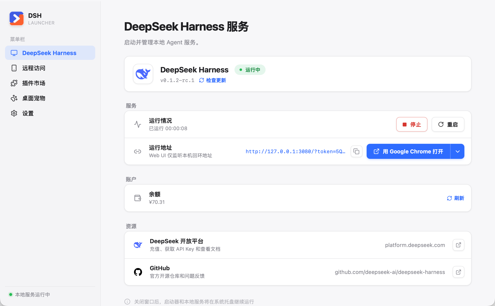
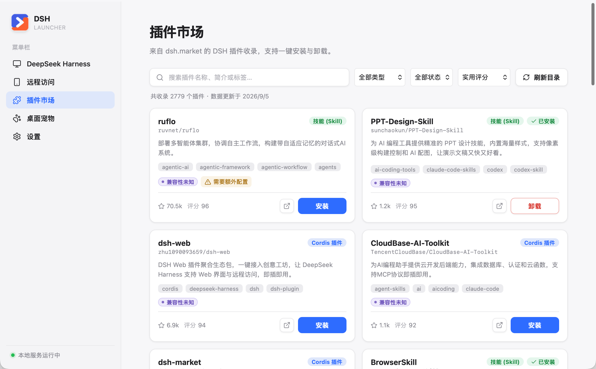
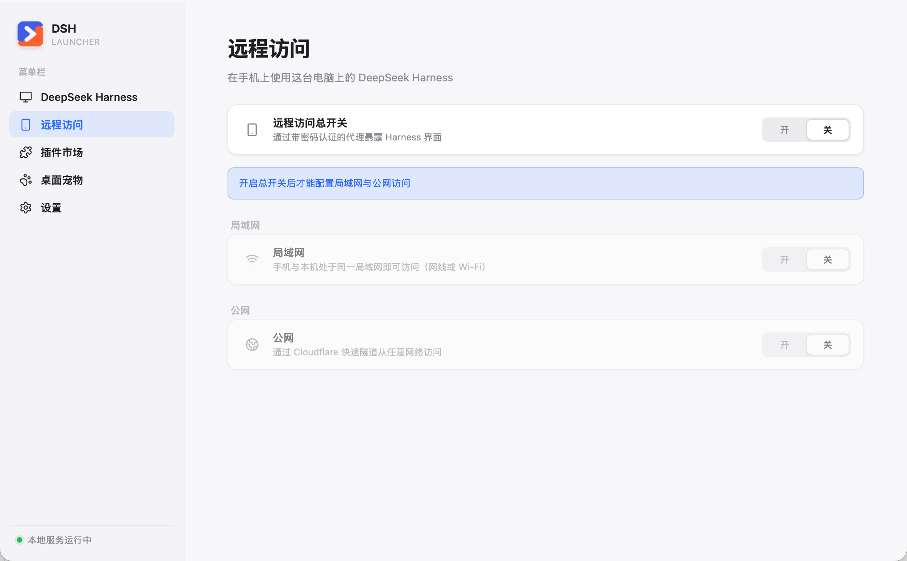
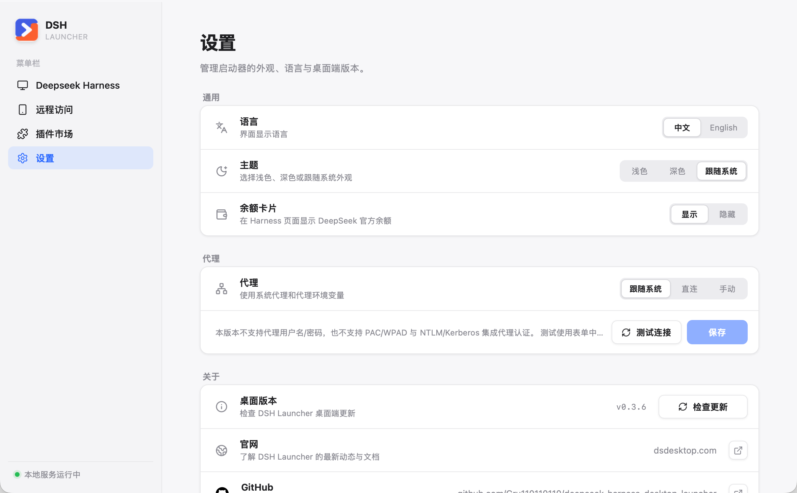

# DSH Launcher

[English](https://github.com/Gru110110110/deepseek-harness-desktop-launcher/blob/main/README.md) | 中文

DSH Launcher 是已发布 `@deepseek-ai/dsh` 包的非官方桌面启动器。桌面应用负责准备隔离的 Node.js/Harness 运行环境、启动 `dsh web`，并打开官方服务实际发布的 URL。

应用以 React 负责表现层，以窄接口的 Tauri 适配层负责系统能力，以可复用的 Rust 核心负责业务规则。它不 fork、也不内嵌 Harness Web UI。

实现与运维细节见 [docs/IMPLEMENTATION.zh.md](docs/IMPLEMENTATION.zh.md)。

## 核心功能

### 启动与管理 DeepSeek Harness

主页负责准备并校验独立的 Node.js/Harness 运行环境，启动或停止官方服务，显示服务实际发布的地址和运行时长，并用你选择的浏览器打开官方 Web UI。Harness 更新与桌面端更新分开呈现，每次变更都清清楚楚。如果更新后出现不兼容的派生会话索引或第三方插件，可使用“修复并启动”从保留的会话日志重建索引，并通过可恢复事务只移除已识别的不兼容插件。已完成的修复备份会按时间、数量和总容量自动回收，也可在设置中查看或立即清理。



### 从插件市场安装扩展

可以在经过校验的市场快照中搜索、筛选、查看、一键安装和一键卸载 Cordis 与 Skill 插件。来源与兼容性正常时，点击一次即可将整组包安装到当前 Harness 网页环境，并在 Harness 空闲时自动重启、检查页面可用性；只有存在真实风险时才要求确认。卸载会按安装记录处理整组包及旧环境中同一插件的市场登记副本，保留共享包与原有配置；生效失败会恢复原环境。旧版独立环境中的插件可点击“修正”接入当前页面。Harness 有工作或无法确认工作状态时，安装与卸载完成后保持当前进程运行，提示用户方便时手动重启；已有待生效变更时，后续安装也不会触发重启。其他情况下由 Harness 沿用原有启动行为自动打开一次网页。如果 Harness 更新后因已安装插件不兼容而启动失败，启动器会通过可恢复卸载重试，并明确告知被移除的插件。



### 让桌面宠物陪你工作

可以选择土拨鼠「麻薯」或橘猫「橘子」作为伙伴。

「桌面宠物」是一项完整内置功能：可以选择伙伴、预览五种状态，并调整大小、气泡、动态效果和鼠标穿透。独立的透明置顶窗口会实时跟随顶层 Harness 任务：仅在模型推理时显示思考，其余活跃阶段显示工作，并在空闲、等待用户或错误时切换到相应状态。快速更新会合并，并且只在动画完整播放一轮后切换，既避免闪动，也不会积压过时状态。宠物位置与偏好会跨启动保存，也可以直接从托盘菜单显示或隐藏。

### 在手机上使用 Harness

远程访问通过启动器自带的认证代理开放仅监听回环地址的 Harness Web UI，既兼容旧版 `dsh web` 的裸地址，也兼容新版带启动令牌的地址，且不会把 Harness 私有令牌放进远程链接。同一局域网内可扫描二维码并输入可轮换的 8 位密码，电脑端使用网线或 Wi-Fi 均可；需要公网访问时，也可以明确开启临时的 Cloudflare 快速隧道。刷新密码会立即吊销已有会话。



### 集中管理启动器设置

设置页集中管理语言、浅色/深色/跟随系统主题、余额卡片、代理模式与连接测试、桌面端更新检查和项目链接。



## 产品范围

- macOS arm64 与 x64 DMG 安装包
- Windows x64 按用户安装的 NSIS 安装包；不再发布便携 ZIP
- 固定 Node.js 24.19.0，只有平台专属 SHA-256 匹配的归档才能进入运行环境
- 通过配置的 npm registry 精确安装 `@deepseek-ai/dsh`
- 由启动器私有运行环境提供的稳定终端 `dsh` 命令
- 浏览器选择、系统托盘生命周期、中英双语、浅色/深色/跟随系统主题
- 基于校验过的 [dsh-market](https://github.com/2BingLing/dsh-market) 快照的插件市场
- Harness 更新与带密码学签名的桌面应用更新相互独立，可选择默认或 Alpha 更新通道；保留上一版运行时时会提供明确的回滚操作
- 带二维码、可轮换密码和可选 Cloudflare 快速隧道的远程访问
- 目录配置驱动、中英双语、可跟随 Harness 五态变化的桌面宠物

## 架构

```text
React 功能注册表 + HashRouter
  └─ 类型化 launcher API / 带 revision 的状态事件
      └─ Tauri 命令与生命周期适配层
          └─ dsh-core 应用服务
              ├─ 运行环境部署与回滚
              ├─ source/CC Switch 导入
              ├─ 托管 dsh web 进程树
              ├─ 插件市场
              ├─ 远程访问代理与 cloudflared 隧道
              ├─ 桌面宠物状态桥与事件服务
              └─ 浏览器与偏好设置端口
                  └─ 固定 Node.js → 已发布 @deepseek-ai/dsh
```

业务规则全部位于不依赖 Tauri 的 `dsh-core`；Tauri 只负责操作系统生命周期、托盘、剪贴板、更新器和类型化 IPC。进程管理、恢复与数据安全行为详见 [docs/IMPLEMENTATION.zh.md](docs/IMPLEMENTATION.zh.md)。

## 开发

依赖：Node.js 24+、pnpm 10.12.3、Rust 1.96。

```sh
validation_root=$(mktemp -d /tmp/dsh-launcher-dev.XXXXXX)
export DSH_DESKTOP_HOME="$validation_root/desktop"
export DSH_HOME="$validation_root/dsh"
export DSH_DESKTOP_SOURCE_HOME="$validation_root/source"
export DSH_DESKTOP_CC_SWITCH_HOME="$validation_root/cc-switch"

pnpm install --frozen-lockfile
pnpm bindings
pnpm lint
pnpm test
pnpm deadcode
pnpm build
cargo test --workspace --all-targets
cargo clippy --workspace --all-targets -- -D warnings
pnpm tauri dev
```

`pnpm bindings` 从 Rust 领域类型生成 [bindings.ts](src/platform/generated/bindings.ts)；生成结果需要提交，并在本机确认重新生成后没有差异。官网与发布/签名流程见 [docs/IMPLEMENTATION.zh.md](docs/IMPLEMENTATION.zh.md)。

## 运行环境变量

| 变量                         | 含义                                                                                                                               |
| ---------------------------- | ---------------------------------------------------------------------------------------------------------------------------------- |
| `DSH_DESKTOP_HOME`           | 启动器/运行环境目录，默认 `~/.dsh-desktop`                                                                                         |
| `DSH_HOME`                   | 显式外部 Harness 目录；会绕过桌面端隔离的 `dsh-home` 并关闭全部导入，只应有意设置                                                  |
| `DSH_DESKTOP_SOURCE_HOME`    | 可选的 source home，默认 `~/.dsh`                                                                                                  |
| `DSH_DESKTOP_CC_SWITCH_HOME` | 可选的只读 CC Switch 来源；Windows 默认跟随 CC Switch 当前数据目录（含 Store 覆盖和旧版 `HOME` 回退），其他平台默认 `~/.cc-switch` |
| `DSH_DESKTOP_NODE_VERSION`   | 精确 Node 覆盖值；必须同时设置 `DSH_DESKTOP_NODE_SHA256`                                                                           |
| `DSH_DESKTOP_NODE_SHA256`    | 自定义 Node 归档的 SHA-256 信任根                                                                                                  |
| `DSH_DESKTOP_NODE_BASES`     | 逗号分隔的 Node 镜像；显式配置会关闭默认回退                                                                                       |
| `DSH_DESKTOP_NPM_REGISTRIES` | 逗号分隔的 npm registry；第一个是版本权威源，后续源只作为同一精确版本的安装镜像；显式配置会关闭默认回退                            |

## 许可

除另有专门声明的部分外，启动器源码使用 MIT 许可。桌面宠物视觉素材版权归 Gru 所有，仅可依据 [`pets/ASSET-LICENSE.md`](pets/ASSET-LICENSE.md) 用于非商业用途。`@deepseek-ai/dsh`、Node.js、Tauri、React 及其他依赖继续适用各自的许可与条款。
